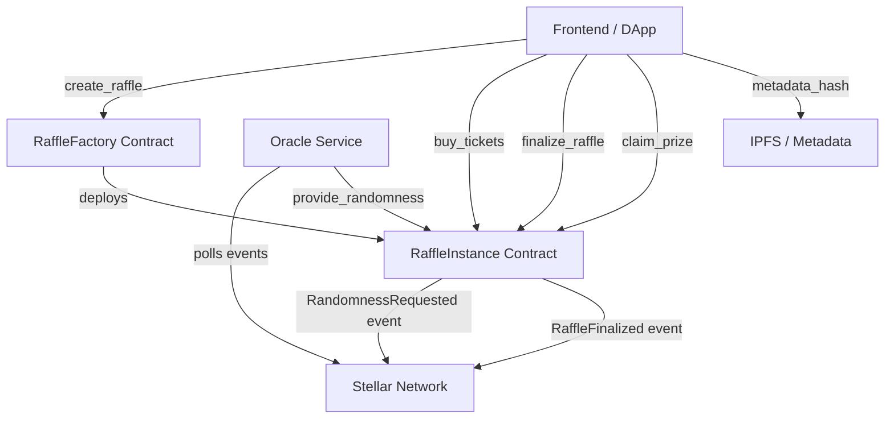
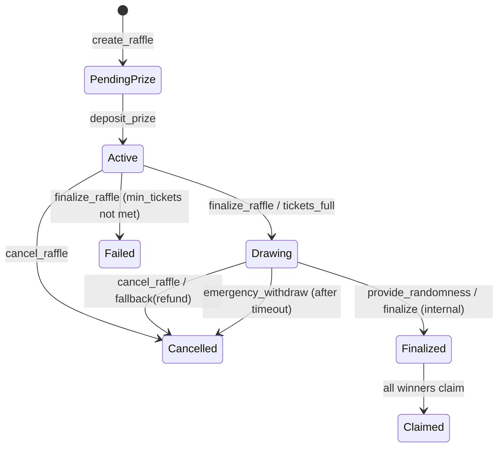
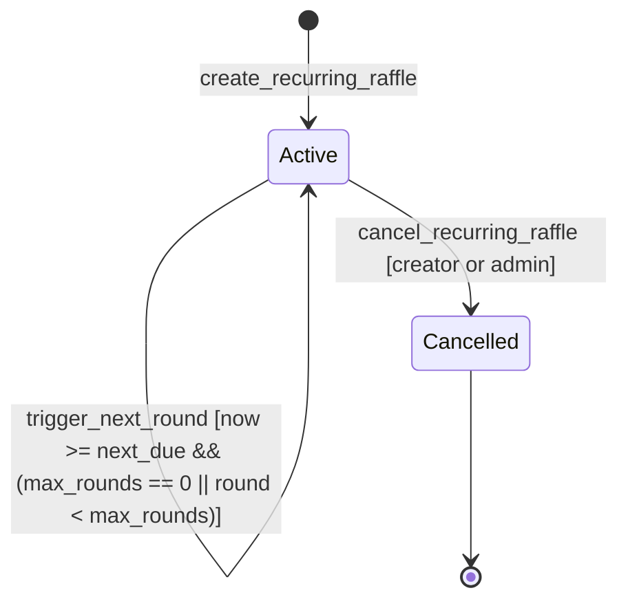

# Tikka Architecture

This document explains how the factory, raffle instances, oracle, and clients interact. For in-depth oracle service architecture, see [ORACLE.md](ORACLE.md).

## Factory -> Instance -> Oracle Flow



### Flow explanation

1. A creator calls `create_raffle` on the factory with `RaffleConfig`.
1. The factory deploys a new raffle instance and returns the new instance address.
1. Users buy tickets directly on the raffle instance contract.
1. When finalization starts, the instance emits randomness request events to the network.
1. The oracle service polls those events and calls `provide_randomness` back on the instance (see [ORACLE.md](ORACLE.md) for pipeline details).
1. The instance finalizes winners, emits finalization events, and winners claim prizes.

## Administrative Control

Both the factory and each raffle instance use a two-step admin transfer. The
current admin calls `transfer_factory_admin` on the factory or `transfer_admin`
on an instance to nominate an address. The nominated address must call
`accept_factory_admin` or `accept_admin` respectively; an instance emits
`AdminChanged` only after acceptance. The current admin can cancel a pending
transfer by nominating itself again.

To synchronize instances during a factory admin rotation, the current factory
admin first calls `transfer_factory_admin(new_admin)`, then calls `sync_admin`
for every instance while the factory transfer is still pending. Each instance
records the proposed factory admin as its pending admin. The new admin accepts
each instance transfer and then calls `accept_factory_admin` on the factory.
This preserves explicit consent at both contract levels.

## RaffleStatus State Machine



### State notes

- `PendingPrize`: created but not funded yet.
- `Active`: funded and selling tickets.
- `Drawing`: draw execution in progress.
- `Finalized`: winners are locked and can claim.
- `Claimed`: terminal state when all claims are complete.
- `Cancelled` / `Failed`: terminal non-success states.

### Who can finalize

`finalize_raffle` is **permissionless**: any address may call it, but only once the raffle is
contractually over. The gate is `time_ended || tickets_full`, evaluated on chain:

- `time_ended` — `ledger_timestamp >= end_time` (skipped when `no_deadline` is `true`).
- `tickets_full` — `tickets_sold >= max_tickets`.

Before either holds, the call reverts with `InvalidStateTransition`, so no raffle can be finalized
early. A second call after the draw has progressed reverts with `InvalidStatus`, so finalization
cannot be repeated.

`finalize_raffle` does **not** require creator authorization. Its preconditions are fully
verifiable on chain, so restricting it to the creator let a creator stall a raffle that was already
over: buyers' funds stayed escrowed, and `refund_ticket` was unavailable because it requires
`Cancelled` or `Failed`. Admin cancellation was the only remaining exit. See [#1000].

### Token egress and escrow solvency

The instance has four intended token-moving paths:

- `claim_prize` pays each unclaimed winner and records protocol fees.
- `sweep_unclaimed` pays unclaimed prizes to the treasury after the claim
  expiry period and marks those prizes claimed.
- `refund_prize` returns the deposited prize after `Cancelled` or `Failed`.
- `refund_ticket` returns each ticket payment after `Cancelled` or `Failed`.
- `withdraw_fees` pays only recorded accumulated fees after finalization.

Administrative escape paths are constrained by the same invariant:

- `emergency_withdraw` is only available for a timed-out `Drawing` raffle.
  Its delay starts at `end_time`, or at the randomness request ledger for a
  no-deadline raffle. It transfers only the deposited prize token and leaves
  all remaining obligations covered.
- `rescue_tokens` can transfer unrelated-token surplus, but for either
  configured raffle token it must leave unpaid ticket refunds, accumulated
  fees, and outstanding prize claims fully covered.
- `sweep_dust` is available only after settlement and transfers payment-token
  surplus above all remaining entitlements; accumulated fees are preserved.

Escrow solvency is a protocol guarantee. After every successful state-changing
entrypoint, configured-token balances must cover all stored entitlements:

```text
balance(prize_token)   >= unclaimed_prize_total
balance(payment_token) >= unrefunded_ticket_total + accumulated_fees_owed
```

When `payment_token == prize_token`, these are enforced as one combined
inequality over the shared token balance. `unclaimed_prize_total`,
`unrefunded_ticket_total`, and `accumulated_fees_owed` are derived from
contract storage, not off-chain indexer state or test bookkeeping.

No token-moving path may reduce a token balance below its outstanding
entitlement. `emergency_withdraw` cannot operate on `Finalized`, because
unclaimed winners remain entitled to their prizes.

### Entrypoint Lifecycle Transition Matrix

The following table summarizes the behavior of mutating contract entrypoints across all 7 `RaffleStatus` states (#623):

| Mutating Entrypoint  | PendingPrize                        | Active                             | Drawing                                                  | Finalized                            | Cancelled                          | Failed                             | Claimed                            |
| -------------------- | ----------------------------------- | ---------------------------------- | -------------------------------------------------------- | ------------------------------------ | ---------------------------------- | ---------------------------------- | ---------------------------------- |
| `deposit_prize`      | **Allowed** (-> Active)             | Rejected (`PrizeAlreadyDeposited`) | Rejected (`PrizeAlreadyDeposited`)                       | Rejected (`PrizeAlreadyDeposited`)   | Rejected (`PrizeAlreadyDeposited`) | Rejected (`PrizeAlreadyDeposited`) | Rejected (`PrizeAlreadyDeposited`) |
| `buy_tickets`        | Rejected (`RaffleInactive`)         | **Allowed** (-> Active / Drawing)  | Rejected (`DrawingAlreadyInProgress` / `RaffleInactive`) | Rejected (`RaffleInactive`)          | Rejected (`RaffleInactive`)        | Rejected (`RaffleInactive`)        | Rejected (`RaffleInactive`)        |
| `finalize_raffle`    | Rejected (`InvalidStateTransition`) | **Allowed** (if ended/full)        | **Allowed** (if Drawing)                                 | Rejected (`InvalidStatus`)           | Rejected (`InvalidStatus`)         | Rejected (`InvalidStatus`)         | Rejected (`InvalidStatus`)         |
| `provide_randomness` | Rejected (`InvalidStatus`)          | Rejected (`InvalidStatus`)         | **Allowed** (-> Finalized)                               | Rejected (`InvalidStatus`)           | Rejected (`InvalidStatus`)         | Rejected (`InvalidStatus`)         | Rejected (`InvalidStatus`)         |
| `claim_prize`        | Rejected (`InvalidStatus`)          | Rejected (`InvalidStatus`)         | Rejected (`InvalidStatus`)                               | **Allowed** (-> Finalized / Claimed) | Rejected (`InvalidStatus`)         | Rejected (`InvalidStatus`)         | Rejected (`InvalidStatus`)         |
| `cancel_raffle`      | **Allowed** (-> Cancelled)          | **Allowed** (-> Cancelled)         | **Allowed** (-> Cancelled)                               | Rejected (`InvalidStatus`)           | Rejected (`InvalidStatus`)         | **Allowed** (-> Cancelled)         | Rejected (`InvalidStatus`)         |
| `refund_ticket`      | Rejected (`InvalidStatus`)          | Rejected (`InvalidStatus`)         | Rejected (`InvalidStatus`)                               | Rejected (`InvalidStatus`)           | **Allowed**                        | **Allowed**                        | Rejected (`InvalidStatus`)         |

## Security: Checks-Effects-Interactions Pattern

All contract entrypoints **MUST** follow this ordering to prevent reentrancy attacks and ensure atomicity.

### The Rule

| Step | Phase            | Description                                          |
| ---- | ---------------- | ---------------------------------------------------- |
| 1    | **CHECK**        | Validate all inputs, conditions, and permissions     |
| 2    | **EFFECTS**      | Perform all state mutations (storage writes)         |
| 3    | **INTERACTIONS** | Make external calls (transfers, factory calls, etc.) |

### Applied to `buy_tickets` and `buy_tickets_for`

```rust
// 1. CHECK: Validate inputs
let _guard = Guard::new(&env)?;        // Reentrancy guard
require_not_paused(&env)?;              // Contract state check
if quantity == 0 { return Err(...); }   // Input validation
if raffle.status != Active { ... }      // State validation

// 2. EFFECTS: Charge payment FIRST (before any state mutation)
token_client.transfer(&buyer, &contract, &total_price)?;

// 3. EFFECTS: Mutate state
env.storage().persistent().set(&DataKey::Ticket(ticket_id), &ticket);
raffle.tickets_sold += quantity;
crate::write_raffle(&env, &raffle);

// 4. INTERACTIONS: External calls LAST
env.invoke_contract(&factory, "record_volume", args);
env.invoke_contract(&factory, "track_participant", args);

### Entrypoint Security Status
Entrypoint	Guard	Payment First	Factory Last	Status
buy_tickets	✅	✅	✅	✅ Fixed (Issue #763)
buy_tickets_for	✅	✅	✅	✅ Fixed (Issue #763)
claim_prize	✅	N/A	N/A	✅ Already has guard
refund_ticket	✅	N/A	N/A	✅ Already has guard
refund_prize	✅	N/A	N/A	✅ Already has guard

### Why This Matters
✅ Prevents reentrancy attacks - No external calls before state is final

✅ Prevents unpaid tickets - Payment must succeed before any state change

✅ Atomicity - If anything fails, the entire transaction reverts

✅ Checks-effects-interactions - Industry standard security pattern

### Historical Context
Issue #763 identified that buy_tickets was violating this pattern:

❌ Payment was happening LAST (after state mutations)

❌ Factory calls were happening BEFORE payment

❌ No reentrancy guard in purchase paths

### Fix applied (Issue #763):

✅ Payment moved to FIRST (before any state mutation)

✅ Reentrancy guard added to both purchase paths

✅ Factory notifications moved to the END (after all state is final)

✅ Event emission moved after state is final

### Testing
A malicious token contract that reenters buy_tickets during the transfer will now:

Find that Guard is already held → Error::Reentrancy

Or find that state is already final → no unpaid tickets can be minted

This closes the attack vector described in Issue #763.

## Pause-Flag Precedence and Emergency Controls

The protocol exposes five pause surfaces. They compose as a logical OR:
an operation is blocked if **any** flag whose scope covers it is set.
There is no override or hierarchy — clearing one flag never clears
another, so each must be lifted independently.

| Flag | Set / clear entrypoints | Scope: blocks |
|---|---|---|
| `DataKey::Paused` (factory) | `pause_factory` / `unpause_factory` (query: `is_factory_paused`) | `create_raffle` and every mutating factory op |
| global pause | `emergency_pause_all` / `emergency_unpause_all` (query: `is_global_paused`) | `create_raffle` **and** ticket purchases on every already-deployed instance (via instance-side `require_global_not_paused`) |
| `DataKey::CreationPaused` | `set_creation_paused` (query: `is_creation_paused`) | `create_raffle` only — all other ops, reads, and in-flight raffles unaffected |
| `DataKey::Paused` (instance) | `pause` / `unpause` | that single instance's mutating ops |
| `Raffle::ticket_sales_paused` | `pause_ticket_sales` / `resume_ticket_sales` | ticket purchases on that single instance |

### Composition Rules

- `emergency_pause_all` blocks `create_raffle` even when `Paused` is
  `false`, because both flags are checked independently.
- `unpause_factory` clears **only** `DataKey::Paused`; it does **not**
  clear the global pause. Use `emergency_unpause_all` for that.
- `require_global_not_paused` in the instance consults the **global**
  flag (`is_global_paused`), so `pause_factory` does **not** stop ticket
  sales on existing raffles — `emergency_pause_all` does.

### Incident Response

To stop everything with a single call, use **`emergency_pause_all`**. It
is the only switch that halts both new-raffle creation and ticket
purchases on all already-deployed instances. See
[`oracle/RUNBOOK.md`](../oracle/RUNBOOK.md).
## Recurring Raffles

Recurring raffles allow creators to deploy an automated, periodic series of raffles (e.g. weekly or monthly) using a single template configuration without manual redeployment.

### State Machine



### Recurring Schedule States

- **`Active` (`active = true`)**: The recurring schedule is running. When the ledger timestamp reaches `next_due`, `trigger_next_round` can be invoked to deploy the instance for the next round.
- **`Cancelled` (`active = false`)**: Terminal state for the recurring schedule. No further rounds can be triggered. Raffles already deployed in previous rounds continue their normal lifecycle unaffected.

### Round Lifecycle & Authorisation Model

1. **Schedule Creation (`create_recurring_raffle`)**:
   - **Auth**: Requires creator authorization (`creator.require_auth()`).
   - **Interval Validation**: Strictly enforces `MIN_RECURRING_INTERVAL_SECONDS` (3,600s / 1 hour) <= `interval_seconds` <= `MAX_RECURRING_INTERVAL_SECONDS` (31,536,000s / 365 days).
   - Sets `current_round = 0`, `active = true`, `next_due = now + interval_seconds`.
   - Emits `RecurringRaffleCreated`.

2. **Round Triggering (`trigger_next_round`)**:
   - **Auth**: **Permissionless.** Any account (cron bots, keepers, users, or the creator) may call `trigger_next_round` once `now >= next_due`. This prevents recurring schedules from stalling if the creator is inactive.
   - Deploys a new raffle instance using `base_config`.
   - Advances `current_round += 1`, updates `next_due = now + interval_seconds`, and records the new raffle address.
   - Emits `RecurringRoundTriggered`.

3. **Max Rounds Semantics**:
   - `max_rounds = 0`: Unlimited (infinite) recurring raffle.
   - `max_rounds > 0`: Capped series. Attempting to trigger beyond `max_rounds` fails with `MaxRoundsReached`.

4. **Prize Funding Responsibility**:
   - Prize funding is **not automatic**. Newly deployed round instances start in the `PendingPrize` status.
   - The creator (or authorized funder) must call `deposit_prize` on the newly deployed raffle instance contract to transition it to `Active` and begin ticket sales.

5. **Cancellation (`cancel_recurring_raffle`)**:
   - **Auth**: Restricted to either the schedule `creator` or the factory `admin`.
   - Sets `active = false` and emits `RecurringRaffleCancelled`.


